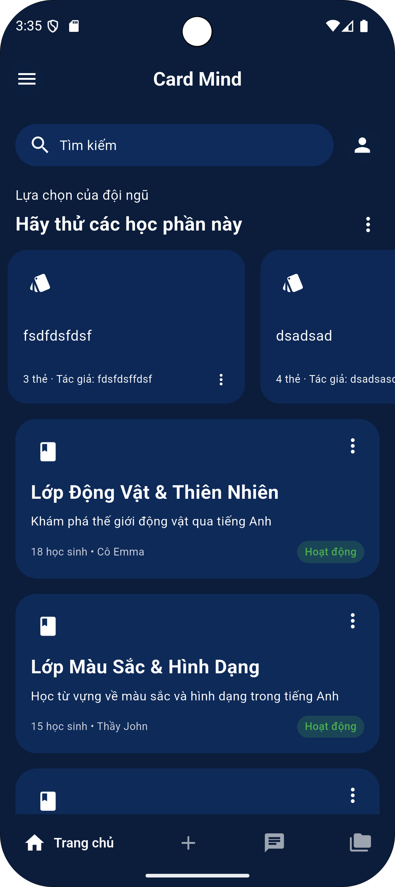
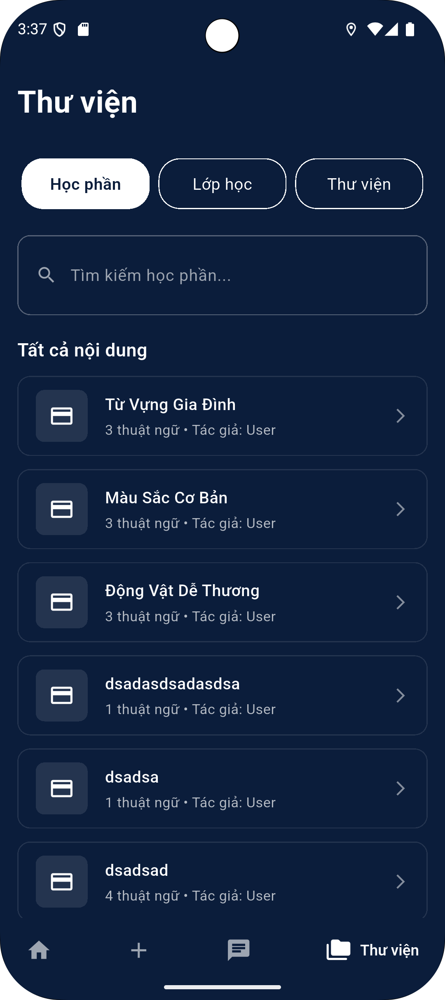
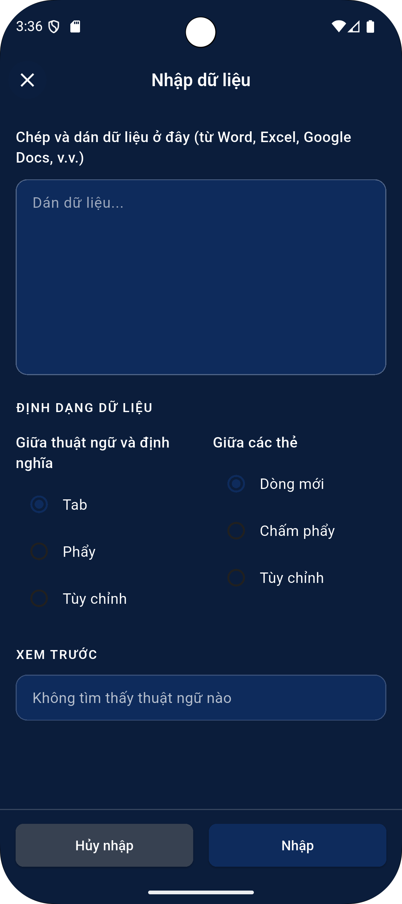

# 🧠 Card Mind - Ứng dụng Flashcard Thông Minh

<div align="center">
  
  
  **Học tập hiệu quả với hệ thống flashcard thông minh**
  
  [](https://flutter.dev/)
  [](https://dart.dev/)
  [](https://firebase.google.com/)
  [](https://hivedb.dev/)
  
  [](https://play.google.com/store/apps/details?id=com.nguyenduc.card_mind)
  [](https://nguyenminhduc163.github.io/Card-Mind)
  [](https://nguyenminhduc163.github.io/Card-Mind)
</div>

## 📱 Giới thiệu

**Card Mind** là một ứng dụng flashcard thông minh được phát triển bằng Flutter, giúp người dùng học tập và ghi nhớ kiến thức một cách hiệu quả. Ứng dụng được thiết kế với giao diện thân thiện, tương thích đa nền tảng và tích hợp các công nghệ hiện đại để mang lại trải nghiệm học tập tối ưu.

### 🌟 **Điểm nổi bật đặc biệt**
- **Thuật toán Spaced Repetition tiên tiến**: Sử dụng phương pháp học ngắt quãn khoa học đã được chứng minh hiệu quả, giúp tăng khả năng ghi nhớ lâu dài lên đến 200%
- **Học tập thông minh**: Ứng dụng tự động điều chỉnh lịch học dựa trên khả năng tiếp thu của từng người dùng
- **Tối ưu hóa thời gian**: Chỉ học những gì cần thiết, không lãng phí thời gian ôn tập những kiến thức đã thuộc
- **🌐 Trải nghiệm ngay**: [Truy cập demo trực tiếp](https://nguyenminhduc163.github.io/Card-Mind) để khám phá tất cả tính năng

## 📥 Tải ứng dụng

Ứng dụng **Card Mind** hiện đã có mặt trên Google Play Store. Tải ngay để bắt đầu hành trình học tập hiệu quả của bạn!

**[⬇️ Tải xuống từ Google Play](https://play.google.com/store/apps/details?id=com.nguyenduc.card_mind)**

## 📸 Demo ứng dụng

<div align="center">
  <table>
    <tr>
      <td align="center">
        
        <br><b>Trang chủ</b>
      </td>
      <td align="center">
        
        <br><b>Khóa học</b>
      </td>
      <td align="center">
        
        <br><b>Tạo flashcard</b>
      </td>
      <td align="center">
        
        <br><b>Chatbot AI</b>
      </td>
    </tr>
  </table>
</div>

## ✨ Tính năng chính

### 🏠 **Trang chủ thông minh**
- Hiển thị các khóa học được đề xuất
- **"Cần ôn tập hôm nay"** - Section đề xuất các thẻ cần ôn theo lịch Spaced Repetition ⭐ **NEW!**
- Tìm kiếm toàn cục các bộ flashcard
- Giao diện responsive trên mọi thiết bị

### 📚 **Tạo và quản lý khóa học**
- Tạo bộ flashcard tùy chỉnh
- Chỉnh sửa nội dung linh hoạt
- Quản lý thư viện cá nhân

### 🧪 **Hệ thống học tập thông minh**
- Chế độ học flashcard với hiệu ứng lật thẻ mượt mà
- **🧠 Spaced Repetition Algorithm** - Thuật toán học ngắt quãn khoa học ⭐ **NEW!**
  - Tự động điều chỉnh tần suất ôn tập dựa trên độ khó của từng thẻ
  - Tối ưu hóa thời gian học tập và tăng hiệu quả ghi nhớ lâu dài
  - Dựa trên nghiên cứu khoa học về trí nhớ và học tập
  - Thẻ dễ nhớ sẽ xuất hiện ít hơn, thẻ khó nhớ sẽ được lặp lại nhiều hơn
  - **Interval tăng dần**: 1 ngày → 3 ngày → 7 ngày → ... (tối đa 180 ngày)
  - **Ease Factor động**: Điều chỉnh độ khó dựa trên kết quả học tập
  - 📖 **[Xem hướng dẫn chi tiết](SPACED_REPETITION_GUIDE.md)**
- Bài kiểm tra đánh giá kiến thức với nhiều dạng câu hỏi
- Theo dõi tiến độ học tập chi tiết và thống kê hiệu quả
- Hệ thống điểm số và streak để tạo động lực học tập

### 🤖 **Trợ lý AI**
- Chatbot hỗ trợ học tập
- Tư vấn và giải đáp thắc mắc
- Lịch sử trò chuyện được lưu trữ

### 📖 **Thư viện đa dạng**
- Quản lý các lớp học
- Chia sẻ bộ flashcard với cộng đồng
- Tìm kiếm và khám phá nội dung mới

## 🛠️ Công nghệ sử dụng

### **Frontend**
- **Flutter 3.29.2** - Framework đa nền tảng
- **Dart 3.7.2** - Ngôn ngữ lập trình
- **Responsive Framework** - Giao diện thích ứng
- **Easy Localization** - Đa ngôn ngữ (Tiếng Việt & Tiếng Anh)

### **Lưu trữ dữ liệu**
- **Hive Database** - Cơ sở dữ liệu local nhanh và nhẹ
- **Firebase Cloud Firestore** - Đồng bộ dữ liệu đám mây
- **Flutter Secure Storage** - Bảo mật thông tin nhạy cảm

### **Tích hợp & Dịch vụ**
- **Firebase Authentication** - Xác thực người dùng
- **Google Sign-In** - Đăng nhập bằng Google
- **Dio** - HTTP client cho API calls
- **Connectivity Plus** - Kiểm tra kết nối mạng

### **UI/UX & Học tập**
- **Material Design 3** - Thiết kế hiện đại
- **Dark/Light Theme** - Chế độ sáng/tối
- **Flip Card Animation** - Hiệu ứng lật thẻ mượt mà
- **Shimmer Loading** - Hiệu ứng tải dữ liệu
- **🧠 Spaced Repetition Algorithm** - Thuật toán học ngắt quãn khoa học
  - Dựa trên nghiên cứu của Hermann Ebbinghaus về "Forgetting Curve"
  - Tự động tính toán thời điểm tối ưu để ôn tập từng thẻ
  - Tích hợp thuật toán SM-2 (SuperMemo) để tối ưu hóa hiệu quả học tập

## 🏗️ Kiến trúc dự án

Dự án được xây dựng theo mô hình **Clean Architecture** với các tầng:

```
lib/
├── core/           # Tầng cốt lõi (theme, routes, services)
│   ├── services/   # SpacedRepetitionService, SampleDataService
│   └── helpers/    # LocalStorageHelper
├── data/           # Tầng dữ liệu (API, local storage)
│   └── models/     # Flashcard, Course, CardReviewData
├── modules/        # Tầng giao diện (screens, widgets)
│   ├── home/       # HomeScreen với "Cần ôn tập hôm nay"
│   └── course/     # DetailFlashCardScreen với spaced repetition
├── providers/      # State management
└── utils/          # Tiện ích hỗ trợ
```

## 🚀 Cài đặt và chạy

### Yêu cầu hệ thống
- Flutter SDK 3.29.2+
- Dart SDK 3.7.2+
- Android Studio / VS Code
- Java 17+ (cho Android)

### Các bước cài đặt

1. **Clone repository**
```bash
git clone https://github.com/your-username/card_mind.git
cd card_mind
```

2. **Cài đặt dependencies**
```bash
flutter pub get
```

3. **Cấu hình Firebase**
- Tải file `google-services.json` vào thư mục `android/app/`
- Cấu hình Firebase project trong console

4. **Chạy ứng dụng**
```bash
flutter run
```

### 🌐 **Demo trực tuyến**
- **Web App**: [Tại đây](https://nguyenminhduc163.github.io/Card-Mind/)
- **Tương thích**: Chrome, Firefox, Safari, Edge
- **Không cần cài đặt**: Chạy trực tiếp trên trình duyệt

## 📱 Hỗ trợ nền tảng

- ✅ **Android** (API 21+)
- ✅ **iOS** (iOS 11.0+)
- ✅ **Web** (Chrome, Firefox, Safari)
- ✅ **Desktop** (Windows, macOS, Linux)

## 🎯 Mục tiêu phát triển

### ✅ **Đã hoàn thành**
- [x] Giao diện người dùng thân thiện và responsive
- [x] Hệ thống flashcard cơ bản với hiệu ứng mượt mà
- [x] **Spaced Repetition Algorithm** - Thuật toán học ngắt quãn khoa học ⭐ **NEW! (v1.0.10)**
  - [x] CardReviewData model với đầy đủ metadata
  - [x] SpacedRepetitionService với SM-2 simplified algorithm
  - [x] Tự động lưu review data khi học flashcard
  - [x] Section "Cần ôn tập hôm nay" trên HomeScreen
  - [x] Interval progression: 1d → 3d → 7d → ... (max 180d)
- [x] Đồng bộ dữ liệu với Firebase Cloud Firestore
- [x] Hỗ trợ đa ngôn ngữ (Tiếng Việt & Tiếng Anh)
- [x] Chatbot AI hỗ trợ học tập
- [x] Hệ thống xác thực và bảo mật

### 🚀 **Đang phát triển**
- [ ] **Spaced Repetition nâng cao**:
  - [ ] Statistics Dashboard với biểu đồ tiến độ
  - [ ] Notification nhắc nhở khi có thẻ cần ôn
  - [ ] Review history và analytics
  - [ ] Custom intervals cho từng khóa học
- [ ] Tích hợp AI để tạo flashcard tự động từ nội dung
- [ ] Hệ thống gamification với điểm số và thành tích
- [ ] Chia sẻ và cộng tác nhóm học tập
- [ ] Thống kê học tập chi tiết và báo cáo tiến độ
- [ ] Tích hợp giọng nói cho phát âm

## 🤝 Đóng góp

Mọi đóng góp đều được chào đón! Vui lòng:

1. Fork dự án
2. Tạo feature branch (`git checkout -b feature/AmazingFeature`)
3. Commit changes (`git commit -m 'Add some AmazingFeature'`)
4. Push to branch (`git push origin feature/AmazingFeature`)
5. Mở Pull Request

## 📄 Giấy phép

Dự án này được phân phối dưới giấy phép MIT. Xem file `LICENSE` để biết thêm thông tin.

<div align="center">
  <p>Được phát triển với Nguyễn Đức ❤️ bằng Flutter</p>
  <p>© 2025 Card Mind. All rights reserved.</p>
</div>
